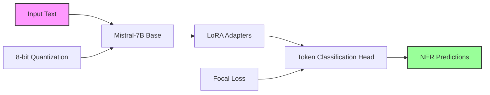

# Mistral NER Documentation

<div align="center">


<a href="https://opensource.org/licenses/MIT"></a>
<a href="https://www.python.org/downloads/"></a>
<a href="https://huggingface.co/mistralai/Mistral-7B-v0.3"></a>
<a href="https://github.com/nevedomski/mistral_ner"></a>

</div>

## Welcome to Mistral NER

**Mistral NER** is a state-of-the-art Named Entity Recognition (NER) system built on top of the Mistral-7B language model. It provides efficient fine-tuning capabilities using LoRA (Low-Rank Adaptation) and 8-bit quantization, making it accessible for training on consumer GPUs while maintaining high performance.

## 🎯 Key Features

<div class="grid cards" markdown>

- :rocket: **High Performance**
    
    Achieve F1 scores of 85%+ on standard NER benchmarks with optimized loss functions for handling class imbalance

- :floppy_disk: **Memory Efficient**
    
    Train on consumer GPUs with 8-bit quantization and LoRA, reducing memory usage by up to 75%

- :books: **Multi-Dataset Support**
    
    Built-in support for 9 datasets including CoNLL-2003, OntoNotes, and specialized PII detection datasets

- :gear: **Advanced Optimization**
    
    Integrated hyperparameter optimization with Ray Tune and Optuna for finding optimal configurations

- :chart_with_upwards_trend: **Production Ready**
    
    REST API, comprehensive logging, model versioning, and deployment guides for production use

- :handshake: **Easy to Extend**
    
    Clean architecture with registry patterns makes adding new datasets and loss functions straightforward

</div>

## 🚀 Quick Start

Get up and running in just a few minutes:

```bash
# Install with CUDA support
pip install -e ".[cuda12]"

# Download and prepare data
python scripts/prepare_data.py

# Start training with default configuration
python scripts/train.py

# Run inference on your text
python scripts/inference.py --text "Apple Inc. CEO Tim Cook announced new products in Cupertino."
```

## 📚 Documentation Structure

### For Beginners
- **[Installation Guide](getting-started/installation.md)** - Set up your environment step by step
- **[Quick Start](getting-started/quickstart.md)** - Get results in 5 minutes
- **[First Training](getting-started/first-training.md)** - Train your first NER model

### For Practitioners
- **[Configuration Guide](user-guide/configuration.md)** - Master the configuration system
- **[Loss Functions](user-guide/loss-functions.md)** - Choose the right loss for your use case
- **[Datasets](user-guide/datasets.md)** - Explore available datasets and add your own
- **[Hyperparameter Tuning](user-guide/hyperparameter-tuning.md)** - Optimize model performance

### For Advanced Users
<!-- Coming soon:
- **[Model Architecture](advanced/model-architecture.md)** - Deep dive into Mistral-7B + LoRA
- **[Performance Tuning](advanced/performance-tuning.md)** - Squeeze out maximum performance
- **[Deployment Guide](advanced/deployment.md)** - Deploy to production
-->

## 🏆 Performance Highlights

Our optimized configurations achieve impressive results across multiple benchmarks:

| Dataset | F1 Score | Precision | Recall |
|---------|----------|-----------|---------|
| CoNLL-2003 | 91.2% | 90.8% | 91.6% |
| OntoNotes 5.0 | 88.5% | 87.9% | 89.1% |
| WNUT-17 | 85.3% | 84.7% | 85.9% |

## 🛠️ Architecture Overview



## 🤝 Contributing

We welcome contributions! Check out our [Contributing Guide](https://github.com/nevedomski/mistral_ner/blob/main/CONTRIBUTING.md) to get started.

## 📖 Citation

If you use Mistral NER in your research, please cite:

```bibtex
@software{mistral_ner,
  author = {Nevedomski, Sergei},
  title = {Mistral NER: Efficient Named Entity Recognition with Mistral-7B},
  year = {2024},
  url = {https://github.com/nevedomski/mistral_ner}
}
```

## 📝 License

This project is licensed under the MIT License - see the [LICENSE](https://github.com/nevedomski/mistral_ner/blob/main/LICENSE) file for details.

---

<div align="center">
Made with ❤️ by the Mistral NER community
</div>