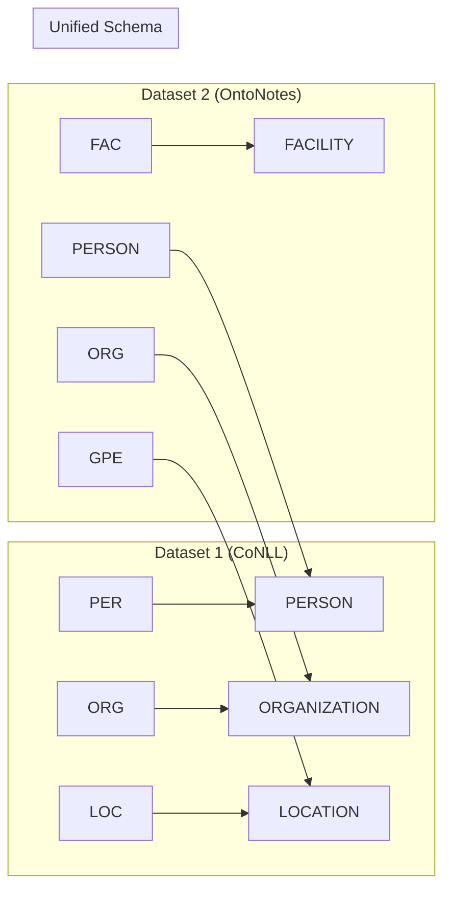

# Datasets for NER Training


## Overview

Mistral NER supports **9 diverse datasets** out of the box, ranging from traditional NER benchmarks to specialized PII detection datasets. The system provides a unified interface for loading, preprocessing, and mixing multiple datasets, enabling you to train models on combined data sources for improved generalization.

## Dataset Catalog

### Traditional NER Datasets

<div class="dataset-card">

#### CoNLL-2003

The gold standard for NER evaluation, featuring news articles in multiple languages.

<div class="dataset-stats">
  <div class="stat-item">
    <div class="stat-value">4</div>
    <div class="stat-label">Entity Types</div>
  </div>
  <div class="stat-item">
    <div class="stat-value">22,137</div>
    <div class="stat-label">Sentences</div>
  </div>
  <div class="stat-item">
    <div class="stat-value">En, De, Es, Nl</div>
    <div class="stat-label">Languages</div>
  </div>
</div>

**Entity Types**: PER (Person), ORG (Organization), LOC (Location), MISC (Miscellaneous)

**Configuration**:
```yaml
data:
  dataset_configs:
    - name: conll2003
      split: train
      language: en  # Options: en, de, es, nl
```

**Example**:
```
[PER John Smith] works at [ORG Microsoft] in [LOC Seattle].
```

</div>

<div class="dataset-card">

#### OntoNotes 5.0

A large-scale multilingual dataset with fine-grained entity types.

<div class="dataset-stats">
  <div class="stat-item">
    <div class="stat-value">18</div>
    <div class="stat-label">Entity Types</div>
  </div>
  <div class="stat-item">
    <div class="stat-value">59,924</div>
    <div class="stat-label">Sentences</div>
  </div>
  <div class="stat-item">
    <div class="stat-value">Multiple</div>
    <div class="stat-label">Domains</div>
  </div>
</div>

**Entity Types**: PERSON, ORG, GPE, DATE, CARDINAL, MONEY, PERCENT, TIME, LOC, FAC, NORP, EVENT, LAW, PRODUCT, QUANTITY, WORK_OF_ART, LANGUAGE, ORDINAL

**Configuration**:
```yaml
data:
  dataset_configs:
    - name: ontonotes
      split: train
      subset: english_v4  # or english_v12, chinese_v4, arabic_v4
```

</div>

<div class="dataset-card">

#### WNUT-17 (Emerging Entities)

Focuses on unusual, previously-unseen entities in social media.

<div class="dataset-stats">
  <div class="stat-item">
    <div class="stat-value">6</div>
    <div class="stat-label">Entity Types</div>
  </div>
  <div class="stat-item">
    <div class="stat-value">5,690</div>
    <div class="stat-label">Sentences</div>
  </div>
  <div class="stat-item">
    <div class="stat-value">Social Media</div>
    <div class="stat-label">Domain</div>
  </div>
</div>

**Entity Types**: person, location, corporation, product, creative-work, group

**Configuration**:
```yaml
data:
  dataset_configs:
    - name: wnut17
      split: train
```

</div>

<div class="dataset-card">

#### Few-NERD

Fine-grained entity recognition with 66 entity types organized hierarchically.

<div class="dataset-stats">
  <div class="stat-item">
    <div class="stat-value">66</div>
    <div class="stat-label">Fine Types</div>
  </div>
  <div class="stat-item">
    <div class="stat-value">8 </div>
    <div class="stat-label">Coarse Types</div>
  </div>
  <div class="stat-item">
    <div class="stat-value">188,238</div>
    <div class="stat-label">Sentences</div>
  </div>
</div>

**Coarse Types**: Location, Person, Organization, Building, Art, Product, Event, Other

**Configuration**:
```yaml
data:
  dataset_configs:
    - name: fewnerd
      split: train
      label_type: coarse  # or fine
      sampling_strategy: inter  # or intra
```

</div>

<div class="dataset-card">

#### WikiNER

Automatically annotated entities from Wikipedia articles.

<div class="dataset-stats">
  <div class="stat-item">
    <div class="stat-value">3</div>
    <div class="stat-label">Entity Types</div>
  </div>
  <div class="stat-item">
    <div class="stat-value">Large Scale</div>
    <div class="stat-label">Size</div>
  </div>
  <div class="stat-item">
    <div class="stat-value">Multi-lingual</div>
    <div class="stat-label">Coverage</div>
  </div>
</div>

**Entity Types**: PER, ORG, LOC

**Configuration**:
```yaml
data:
  dataset_configs:
    - name: wikiner
      split: train
      language: en  # Many languages available
```

</div>

### PII Detection Datasets

<div class="dataset-card">

#### Gretel AI Synthetic PII (Finance)

High-quality synthetic data for financial PII detection.

<div class="dataset-stats">
  <div class="stat-item">
    <div class="stat-value">29</div>
    <div class="stat-label">PII Types</div>
  </div>
  <div class="stat-item">
    <div class="stat-value">105,411</div>
    <div class="stat-label">Records</div>
  </div>
  <div class="stat-item">
    <div class="stat-value">Finance</div>
    <div class="stat-label">Domain</div>
  </div>
</div>

**PII Types**: credit_card, ssn, email, phone, address, account_number, routing_number, swift_code, and more

**Configuration**:
```yaml
data:
  dataset_configs:
    - name: gretel_pii
      split: train
```

</div>

<div class="dataset-card">

#### AI4Privacy PII Masking

Comprehensive PII detection with 54 distinct classes.

<div class="dataset-stats">
  <div class="stat-item">
    <div class="stat-value">54</div>
    <div class="stat-label">PII Classes</div>
  </div>
  <div class="stat-item">
    <div class="stat-value">~65K</div>
    <div class="stat-label">Examples</div>
  </div>
  <div class="stat-item">
    <div class="stat-value">Comprehensive</div>
    <div class="stat-label">Coverage</div>
  </div>
</div>

**PII Types**: NAME, EMAIL, PHONE, ADDRESS, SSN, CREDIT_CARD, DATE_OF_BIRTH, MEDICAL_RECORD, and many more

**Configuration**:
```yaml
data:
  dataset_configs:
    - name: ai4privacy
      split: train
```

</div>

<div class="dataset-card">

#### Mendeley Synthetic PII

Large-scale synthetic PII dataset with realistic patterns.

<div class="dataset-stats">
  <div class="stat-item">
    <div class="stat-value">200K</div>
    <div class="stat-label">Examples</div>
  </div>
  <div class="stat-item">
    <div class="stat-value">Synthetic</div>
    <div class="stat-label">Data Type</div>
  </div>
  <div class="stat-item">
    <div class="stat-value">Multi-domain</div>
    <div class="stat-label">Coverage</div>
  </div>
</div>

**Configuration**:
```yaml
data:
  dataset_configs:
    - name: mendeley_pii
      split: train
```

</div>

<div class="dataset-card">

#### BigCode PII (Software)

Specialized for detecting PII in source code and technical documentation.

<div class="dataset-stats">
  <div class="stat-item">
    <div class="stat-value">Code-specific</div>
    <div class="stat-label">Focus</div>
  </div>
  <div class="stat-item">
    <div class="stat-value">Gated</div>
    <div class="stat-label">Access</div>
  </div>
  <div class="stat-item">
    <div class="stat-value">Software</div>
    <div class="stat-label">Domain</div>
  </div>
</div>

**Note**: Requires HuggingFace authentication token.

**Configuration**:
```yaml
data:
  dataset_configs:
    - name: bigcode_pii
      split: train
      auth_token: ${HF_TOKEN}  # Set in environment
```

</div>

## Multi-Dataset Training

One of Mistral NER's most powerful features is the ability to train on multiple datasets simultaneously, leveraging diverse data sources for better generalization.

### Mixing Strategies

#### 1. Concatenation (Default)

Simply combines all datasets into one large training set.

```yaml
data:
  dataset_configs:
    - name: conll2003
    - name: ontonotes
  mixing_strategy: concatenate
```

**Use when**: Datasets have similar characteristics and you want maximum data.

#### 2. Interleaving

Alternates between datasets during training, ensuring balanced exposure.

```yaml
data:
  dataset_configs:
    - name: conll2003
    - name: gretel_pii
  mixing_strategy: interleave
  interleave_probs: [0.7, 0.3]  # 70% CoNLL, 30% Gretel
```

**Use when**: Datasets have different sizes and you want balanced training.

#### 3. Weighted Sampling

Samples from datasets based on specified weights.

```yaml
data:
  dataset_configs:
    - name: conll2003
      weight: 2.0
    - name: wnut17
      weight: 1.0
    - name: ai4privacy
      weight: 1.5
  mixing_strategy: weighted
  sampling_temperature: 1.0  # Controls randomness
```

**Use when**: You want fine control over dataset contribution.

### Label Mapping

When combining datasets, label conflicts are automatically resolved:



### Configuration Examples

#### Example 1: Combined Traditional NER

```yaml
data:
  dataset_configs:
    - name: conll2003
      split: train
    - name: ontonotes
      split: train
      subset: english_v4
    - name: wnut17
      split: train
  mixing_strategy: interleave
  max_length: 256
  label_all_tokens: false
```

#### Example 2: PII Detection Focus

```yaml
data:
  dataset_configs:
    - name: gretel_pii
      weight: 2.0
    - name: ai4privacy
      weight: 2.0
    - name: mendeley_pii
      weight: 1.0
    - name: conll2003  # For general NER capability
      weight: 0.5
  mixing_strategy: weighted
  sampling_temperature: 0.5  # More deterministic sampling
```

#### Example 3: Comprehensive Model

```yaml
data:
  dataset_configs:
    - name: conll2003
    - name: ontonotes
    - name: fewnerd
      label_type: coarse
    - name: gretel_pii
    - name: ai4privacy
  mixing_strategy: concatenate
  # Unified label schema will be created automatically
```

## Adding Custom Datasets

### Step 1: Create Dataset Loader

Create a new loader in `src/datasets/loaders/`:

```python
from typing import Dict, List, Any
from datasets import Dataset, load_dataset
from ..base import BaseNERDataset

class MyCustomDataset(BaseNERDataset):
    """Custom dataset loader."""
    
    LABEL_MAPPING = {
        "person": "PERSON",
        "place": "LOCATION",
        "company": "ORGANIZATION",
        # Add your mappings
    }
    
    def load(self) -> Dataset:
        """Load the dataset."""
        # Option 1: Load from HuggingFace
        dataset = load_dataset("username/dataset-name", split=self.split)
        
        # Option 2: Load from local files
        # dataset = self._load_from_files("path/to/data")
        
        return dataset
    
    def get_labels(self) -> List[str]:
        """Return list of labels."""
        return ["O", "B-PERSON", "I-PERSON", "B-LOCATION", ...]
```

### Step 2: Register Dataset

Add to the registry in `src/datasets/registry.py`:

```python
from .loaders.my_custom import MyCustomDataset

# In DatasetRegistry._register_default_loaders()
self.register("my_custom", MyCustomDataset)
```

### Step 3: Use in Configuration

```yaml
data:
  dataset_configs:
    - name: my_custom
      split: train
      # Custom parameters if needed
```

## Dataset Statistics and Analysis

### Understanding Your Data

Use the built-in analysis tools:

```python
from src.datasets import DatasetRegistry, DatasetMixer

# Load datasets
registry = DatasetRegistry()
datasets = [
    registry.get_loader("conll2003").load(),
    registry.get_loader("gretel_pii").load()
]

# Analyze
mixer = DatasetMixer(strategy="concatenate")
mixed_data = mixer.mix(datasets)

# Get statistics
print(f"Total examples: {len(mixed_data)}")
print(f"Label distribution: {mixer.get_label_distribution()}")
print(f"Average sequence length: {mixer.get_avg_sequence_length()}")
```

### Visualization

The system provides visualization tools for dataset analysis:

```python
from src.visualization import plot_label_distribution, plot_dataset_comparison

# Visualize label distribution
plot_label_distribution(train_dataset, save_path="label_dist.png")

# Compare datasets
plot_dataset_comparison(
    datasets={"CoNLL": conll_data, "OntoNotes": onto_data},
    save_path="dataset_comparison.png"
)
```

## Best Practices

### 1. Start Simple

Begin with a single dataset to establish baseline performance:

```yaml
data:
  dataset_configs:
    - name: conll2003
```

### 2. Add Gradually

Add datasets one at a time, monitoring performance:

```yaml
# Iteration 1: Baseline
- name: conll2003

# Iteration 2: Add similar dataset
- name: conll2003
- name: ontonotes

# Iteration 3: Add specialized data
- name: conll2003  
- name: ontonotes
- name: gretel_pii
```

### 3. Balance Dataset Sizes

Use weights or interleaving to prevent large datasets from dominating:

```yaml
data:
  dataset_configs:
    - name: large_dataset
      weight: 1.0
    - name: small_dataset  
      weight: 5.0  # Upweight smaller dataset
```

### 4. Monitor Label Distribution

Ensure rare labels are adequately represented:

```python
# Check label distribution after mixing
label_counts = mixer.get_label_distribution()
for label, count in sorted(label_counts.items()):
    print(f"{label}: {count} ({count/total*100:.1f}%)")
```

## Performance Considerations

### Memory Usage

Different datasets have different memory footprints:

| Dataset | Approx. Memory | Tokens/Example |
|---------|----------------|----------------|
| CoNLL-2003 | 500 MB | 15-20 |
| OntoNotes | 1.5 GB | 20-30 |
| Few-NERD | 2.0 GB | 25-35 |
| WikiNER | 3.0 GB+ | 20-25 |

### Loading Time

Use caching to speed up repeated loads:

```yaml
data:
  cache_dir: ~/.cache/mistral_ner
  preprocessing_num_workers: 4
```

### Batch Composition

With multiple datasets, consider batch composition:

```yaml
training:
  per_device_train_batch_size: 8
  gradient_accumulation_steps: 4
  # Effective batch size: 32
  # Ensures good representation from each dataset
```

## Troubleshooting

### Issue: Label mismatch errors

**Solution**: Check label mappings are consistent:

```python
# Debug label mappings
for dataset_config in config.dataset_configs:
    loader = registry.get_loader(dataset_config.name)
    print(f"{dataset_config.name}: {loader.get_labels()}")
```

### Issue: Memory overflow with multiple datasets

**Solution**: Use streaming or reduce dataset sizes:

```yaml
data:
  dataset_configs:
    - name: large_dataset
      max_examples: 10000  # Limit examples
  streaming: true  # Use streaming mode
```

### Issue: Imbalanced training with mixed datasets

**Solution**: Adjust mixing strategy:

```yaml
data:
  mixing_strategy: interleave
  interleave_probs: null  # Auto-calculate based on dataset sizes
```

## Next Steps

!!! tip "Optimize Your Training"
    Now that you understand datasets, explore [Hyperparameter Tuning](hyperparameter-tuning.md) 
    to find the best configuration for your data combination.